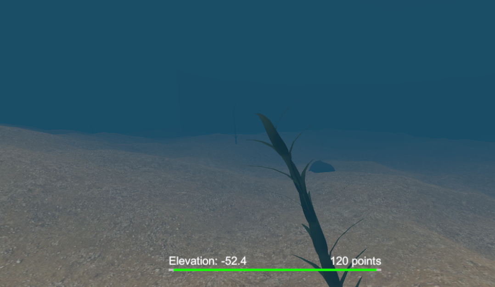
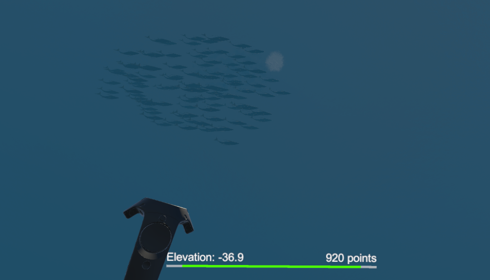
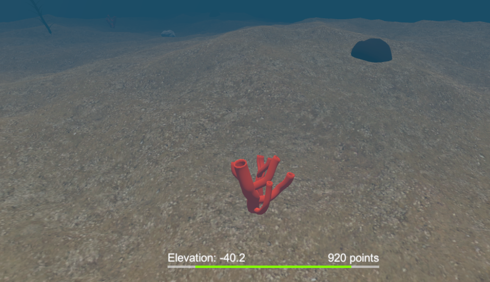
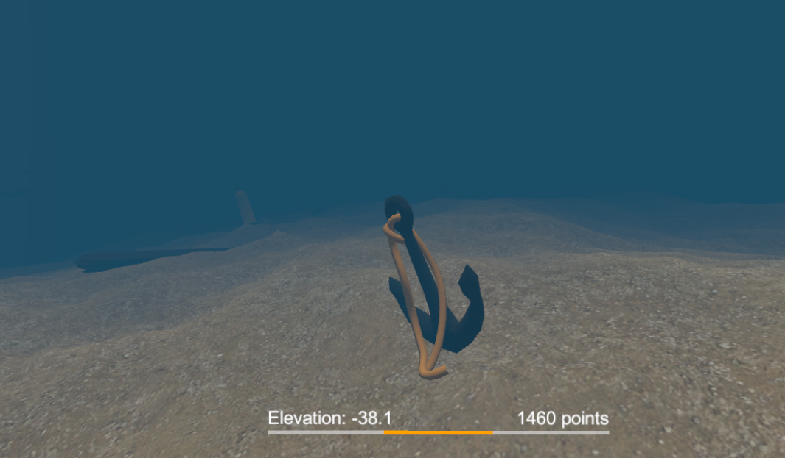
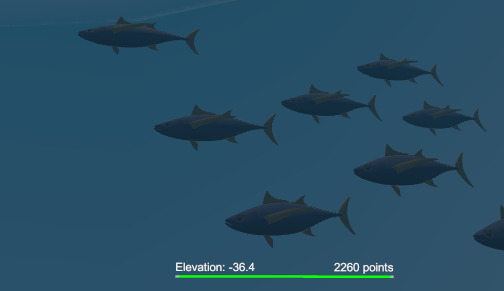
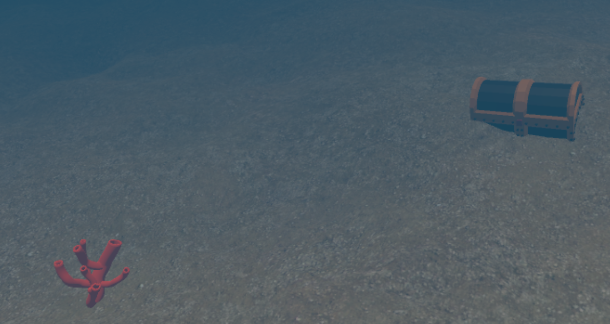

# Ocean Dive

Ocean Dive is a VR game that simulates diving in the ocean. The player can discover fish species and pick up objects from the sea floor, but they must return to the surface before running out of oxygen.

The project was created with Unity for HTC Vive using [VRTK](https://github.com/thestonefox/VRTK).

